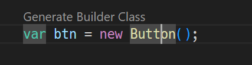
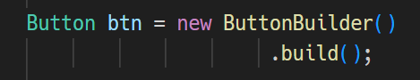
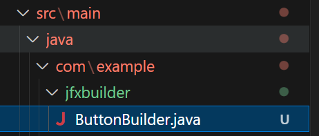
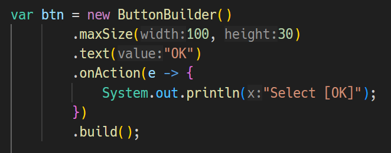

# JavaFX Builder Class Generator

This VSCode extension provides builder class generator for JavaFX projects.

You can generate Builder classes from the classes included in the javafx.scene.* packages, such as Button and VBox, enabling you to write complex instances more compactly.

# How to use

## 1. 🏃‍➡️ Move the cursor over a "new ClassName()" expression.
- The class must be in the javafx.scene.* packages.
- The class name must be a canonical name or resolved through an import.
- Cannot generate builder class if a class has no setXXX methods.

## 2. 🔧 Press "Generate Builder Class" Code Lens.

- As a result, a Builder class is generated and replaces the original class on the cursor position.

## 3. 🎁 A Builder class is generated under the jfxbuilder directory.

- The Builder class is named by appending the postfix "-Builder" to the original class name.

## 4. ⚙️ The Builder class has the same setter methods as the original class, but the "set-" prefix is omitted.

- In the example below, the Builder class for the Button class is ButtonBuilder, and instead of the setMaxSize method, it has a maxSize method. 

- The return type of the maxSize method is ButtonBuilder.

   

# Miscellaneous

## Requirements

- Use Maven standard directory layout.
  - The Java files must be under the src/main/java directory, e.g., src/main/java/com/example/FooController.java
- Install "Language Support for Java(TM) by Red Hat" extension to enable Builder generator.

## Extension Settings

This extension does not contribute any settings.

## Issues

https://github.com/sosuisen/javafx-builder-class-generator/issues

## Release Notes

### 1.0.0

- Initial release.
