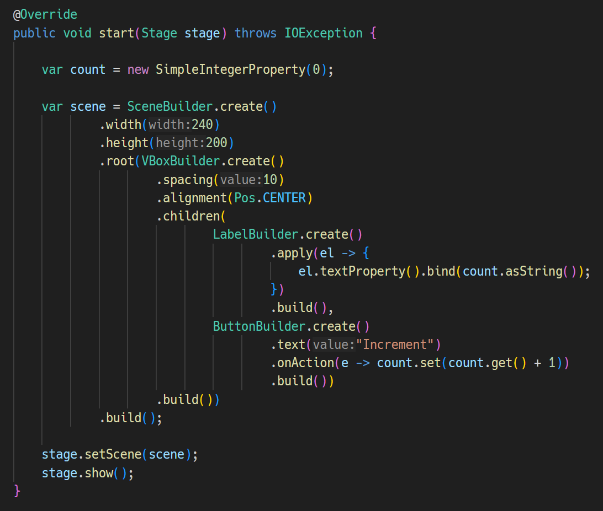
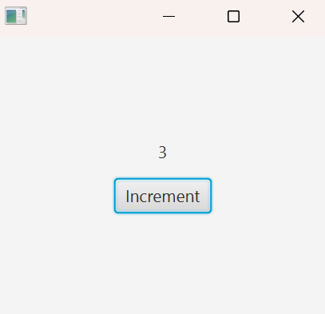

# JavaFX Builder Class Generator

This VSCode extension provides a code generator for creating builder classes in JavaFX projects.

You can generate builder classes for various types included in the `javafx.scene.*` packages, such as `Button` and `VBox`,
allowing you to create complex instances more compactly.

   

# How to Use

## 1. 🏃‍➡️ Move the cursor over a "new ClassName()" expression.
- The class must be from the `javafx.scene.*` packages.
- The class name must be a canonical name or resolved through an import.
- A builder class cannot be generated if the class has no "set-" methods.
- Ensure that the expression is grammatically correct, including the use of a semicolon at the end of the statement. If you perform this action, the "Generate Builder Class" Code Lens will appear.


## 2. 🔧 Press "Generate Builder Class" Code Lens.

- A builder class is generated and replaces the original class at the cursor position.


## 3. 🎁 A builder class is created under the jfxbuilder directory.

- The builder class is named by appending the postfix "-Builder" to the original class name.


## 4. ⚙️ The builder class includes the same setter methods as the original class, but the "set-" prefix is omitted.

- In the example below, the builder class for the `Button` class is `ButtonBuilder`, which includes a `maxSize` method instead of the `setMaxSize` method.

- The return type of the `maxSize` method is `ButtonBuilder`.

- To create an instance of the original class, call `build()` at the end of the method chain.

   

# Example





## `children` method

A builder class for a class that has a `getChildren` method includes a `children` method.

Usage follows the example provided above.

```java
public VBoxBuilder children(Node... elements) { in.getChildren().setAll(elements); return this; }
```

## `apply` method

All builder classes have an `apply` method. 
You can pass a lambda that takes an instance of the original class as an argument to this method.

Usage follows the example provided above.

```java
public LabelBuilder apply(java.util.function.Consumer<Label> func) {
        func.accept((Label) in);
        return this;
    }
```

In fact, everything can be accomplished with `apply`. The other methods in the builder class simply provide syntactic sugar for the original class's `set-` methods and the `getChildren` method.

# Miscellaneous

## Requirements

- The Java files must be located somewhere under the `src` directory, e.g., `src/main/java/com/example/FooController.java`
- Install the "Language Support for Java(TM) by Red Hat" extension to enable the builder class generator.
- A module-info.java file is required.
- A class that extends `javafx.application.Application` is needed.

## Issues

- This plugin will not function unless the "Language Support for Java™ by Red Hat" extension is activated. If you encounter any issues, first ensure that this extension has been successfully activated.

- If you experience any problems with the JavaFX Builder Class Generator, please create an issue in the GitHub repository.
https://github.com/sosuisen/javafx-builder-class-generator/issues

## Release Notes

### 1.1.0

- Added `apply` method to the builder class.
- Use `create` method to create a builder instance instead of using a constructor.
- Added `children` method if the original class has a `getChildren` method.
- The `create` method has parameters if the original constructor has parameters.
- Added methods to set parameters indicated in the original constructor.

### 1.0.0

- Initial release.
