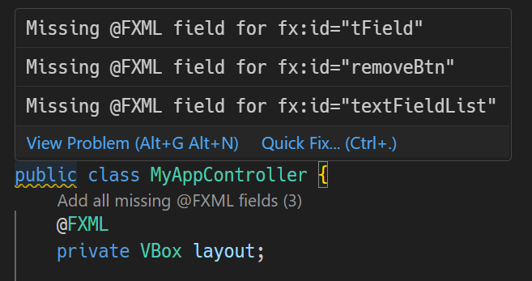
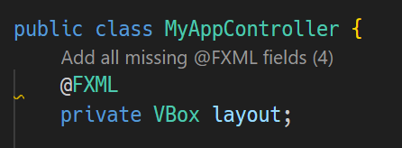
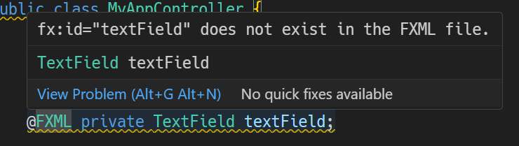
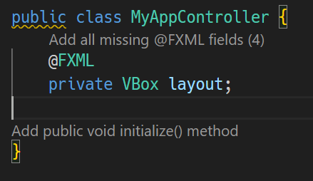

# JavaFX Controller Support README

This VSCode extension provides support for FXML controllers in JavaFX projects.

## Features

### (1) 🔔 Detection and correction of fx:id errors.

#### 🔍 Displays diagnostics when an fx:id in the FXML does not have a corresponding @FXML field in the controller class.

🛠️ Automatically adds the necessary @FXML fields for fx:id individually through Quick Fix.

🔍 Provides a Code Lens option "Add all missing @FXML fields" to automatically add all missing @FXML fields for fx:id.

#### 📺 Displays diagnostics when an @FXML field specified in the controller class does not have a corresponding fx:id in the FXML.

### (2) 📢 Provides a Code Lens option to add an initialize method if it is missing from the Controller class.

Press "Add public void initialize() method" to add the initialize method.

Result:

### (3) 🚧 Builder generator

Generates a builder class for a classe in javafx.scene.* packages.

1. 🏃‍➡️ Move the cursor over a "new ClassName()" expression.
- ClassName must be in the javafx.scene.* packages.
- The class name must be a canonical name or resolved through an import.

2. 🔧 Press "Generate Builder Class" Code Lens.

- As a result, the Builder class is generated and replaces the original class in the source code.

3. 🎁 A Builder class is generated under the jfxbuilder directory.

- The Builder class is named by appending the suffix "-Builder" to the original class name.

4. ⚙️ The Builder class has the same setter methods as the original class, but the "set-" prefix is omitted.

- In the example below, the Builder class for the Button class is ButtonBuilder, and instead of the setMaxSize method, it has a maxSize method. 

- The return type of the maxSize method is ButtonBuilder.

   

## Requirements

- Use Maven standard directory layout.
  - The Java files must be under the src/main/java directory, e.g., src/main/java/com/example/FooController.java
  - The FXML files must be under the src directory, e.g., src/main/resources/com/example/foo.fxml
- fx:controller must be specified in the FXML file.
- Install "Language Support for Java(TM) by Red Hat" extension to enable Builder generator.

## Extension Settings

This extension does not contribute any settings.

## Issues

https://github.com/sosuisen/javafx-controller-support/issues

## Release Notes

### 1.1.0

- Added Builder generator.

### 1.0.0

- Initial release.
