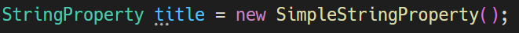

# JavaFX Property Support

This VSCode extension provides a getter and setter generator for JavaFX properties.

## 1. 🏃‍➡️ Move the cursor over a property field name.
- Hint dots (...) will appear under the field name when you can generate a getter and setter.



## 2. 🔧 Open the code action and select "Generate Getter and Setter."

- You can open the code action by pressing 'Ctrl+.' (or 'Cmd+.' on Mac).


## 3. 🎁 Getter and setter are created at the end of the class block.


# Generation Rules

- A property getter, a general getter, and a general setter are generated.
- The method name is automatically derived from the private property field name. 
  - "private StringProperty title" -> "public String getTitle()"
- However, if the field name ends with a string that starts with "Prop," that portion is ignored.
  - "private StringProperty nameProp" -> "public String getName()"
  - "private StringProperty nameProperty" -> "public String getName()"
- A read-only wrapper does not generate a setter.
- ObjectProperty<T> is unboxed when possible.
  - "private ObjectProperty<Integer> priority" -> "public int getPriority()"

# Examples

```java
private final StringProperty title = new SimpleStringProperty();

// title
public StringProperty titleProperty() {
	return title;
}

public String getTitle () {
	 return title.get();
}

public void setTitle (String title) {
	 this.title.set(title);
}
```

```java
private final StringProperty nameProp = new SimpleStringProperty();

// name
public StringProperty nameProperty() {
	return nameProp;
}

public String getName() {
	return nameProp.get();
}

public void setName(String name) {
	this.nameProp.set(name);
}
```
```java
private final BooleanProperty completed = new SimpleBooleanProperty();

// completed
public BooleanProperty completedProperty() {
	return completed;
}

public boolean isCompleted() {
	return completed.get();
}

public void setCompleted(boolean completed) {
	this.completed.set(completed);
}
```
```java
private final ObjectProperty<LocalDate> date = new SimpleObjectProperty<>();
	
// date
public ObjectProperty<LocalDate> dateProperty() {
	return date;
}

public LocalDate getDate() {
	return date.get();
}

public void setDate(LocalDate date) {
	this.date.set(date);
}
```
```java
private final ObjectProperty<Integer> priority = new SimpleObjectProperty<>();
// priority
public ObjectProperty<Integer> priorityProperty() {
	return priority;
}

public int getPriority() {
	return priority.get();
}

public void setPriority(int priority) {
	this.priority.set(priority);
}
```
```java
private final ReadOnlyStringWrapper readOnlyTitle = new ReadOnlyStringWrapper();

// readOnlyTitle
public ReadOnlyStringProperty readOnlyTitleProperty() {
	return readOnlyTitle.getReadOnlyProperty();
}

public String getReadOnlyTitle() {
	return readOnlyTitle.get();
}
```
```java
private final MapProperty<String, String> dataMap = new SimpleMapProperty<>(FXCollections.observableHashMap());

// dataMap
public MapProperty<String, String> dataMapProperty() {
	return dataMap;
}

public ObservableMap<String, String> getDataMap() {
	return dataMap.get();
}

public void setDataMap(ObservableMap<String, String> dataMap) {
	this.dataMap.set(dataMap);
}
```
```java
private final ReadOnlyMapWrapper<String, String> readOnlyDataMap = new ReadOnlyMapWrapper<>(dataMap);
	// readOnlyDataMap
	public ReadOnlyMapProperty<String, String> readOnlyDataMapProperty() {
		return readOnlyDataMap.getReadOnlyProperty();
	}

	public ObservableMap<String, String> getReadOnlyDataMap() {
		return readOnlyDataMap.get();
	}
```